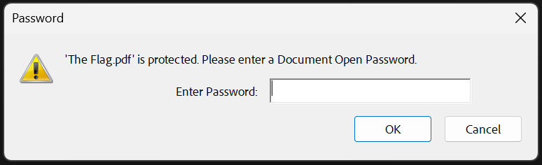
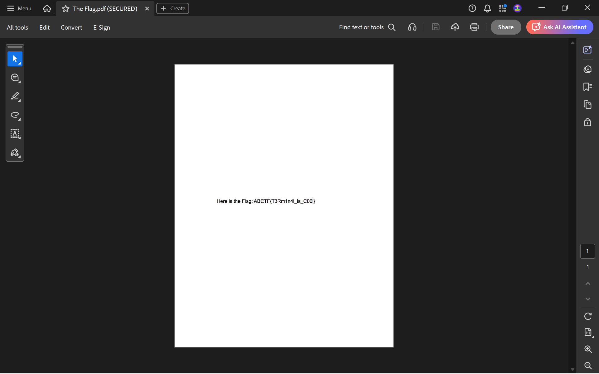

# Taking LS

## Deskripsi

Just take the Ls. Check out this zip file and I be the flag will remain hidden.
[The Flag.zip](https://mega.nz/#!mCgBjZgB!_FtmAm8s_mpsHr7KWv8GYUzhbThNn0I8cHMBi4fJQp8)

---

## Analisis

Diberikan file arsip `The Flag.zip`. Setelah diekstrak, struktur file yang dihasilkan adalah sebagai berikut:

```bash
unzip 'The Flag.zip'
```

Output:

```
Archive:  The Flag.zip
   creating: The Flag/
  inflating: The Flag/.DS_Store
   creating: __MACOSX/
   creating: __MACOSX/The Flag/
  inflating: __MACOSX/The Flag/._.DS_Store
   creating: The Flag/.ThePassword/
  inflating: The Flag/.ThePassword/ThePassword.txt
  inflating: The Flag/The Flag.pdf
  inflating: __MACOSX/The Flag/._The Flag.pdf
```

Dari hasil ekstraksi tersebut, terlihat adanya direktori tersembunyi bernama `.ThePassword`.
Di dalamnya terdapat file `ThePassword.txt` yang menarik untuk diperiksa lebih lanjut.

Isi file tersebut adalah:

```
Nice Job!  The Password is "Im The Flag".
```

Selanjutnya, membuka file `The Flag.pdf` dan diketahui bahwa file tersebut dilindungi oleh sebuah password.


---

## Penyelesaian

Password yang ditemukan pada file `ThePassword.txt`, yaitu:

```
Im The Flag
```

digunakan untuk membuka file `The Flag.pdf`.
Setelah file berhasil dibuka, flag dapat ditemukan di dalam dokumen tersebut.


---

## Flag

```ABCTF{T3Rm1n4l_is_C00l}```
