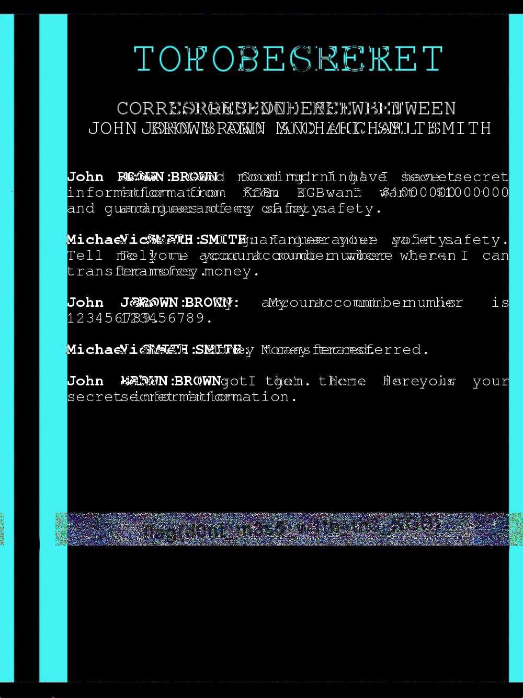

# The Adventures of Boris Ivanov – Part 1

## Challenge

The KGB agent Boris Ivanov got information about an attempt to sell classified data. He quickly reacted and intercepted the correspondence. Help Boris understand what exactly they were trying to sell.  
Here is the interception data: [Boris_Ivanov_1.jpg](https://mega.nz/#!HfAHmKQb!zg6EPqfwes1bBDCjx7-ZFR_0O0-GtGg2Mrn56l5LCkE)

---

## Analisis

Diberikan sebuah file gambar JPEG bernama `Boris_Ivanov_1.jpg`.
Saat dibuka secara normal, gambar menampilkan dokumen bertuliskan **“TOP SECRET”** berisi percakapan antara *John Brown* dan *Michael Smith* terkait transaksi informasi rahasia.

Namun, terdapat kejanggalan pada bagian bawah gambar berupa **area horizontal dengan pola noise RGB acak**.  
  
  
  
Pola noise semacam ini sering menjadi indikasi adanya **data tersembunyi menggunakan teknik steganografi**, khususnya tipe **stereogram**, di mana pesan disembunyikan melalui pergeseran piksel, bukan teks biasa.

---

## Analisis Steganografi

Berdasarkan indikasi tersebut, gambar dianalisis lebih lanjut menggunakan **StegSolve** dengan memeriksa berbagai offset piksel.

Setelah melakukan penyesuaian offset, ditemukan bahwa pada **offset 898** noise tersebut berubah menjadi teks yang dapat dibaca.



Hal ini mengonfirmasi bahwa gambar tersebut memang mengandung **pesan tersembunyi** yang tidak dapat dilihat secara kasat mata tanpa teknik analisis yang tepat.

---

## Flag

```text
flag{d0nt_m3s5_w1th_th3_KGB}
```
