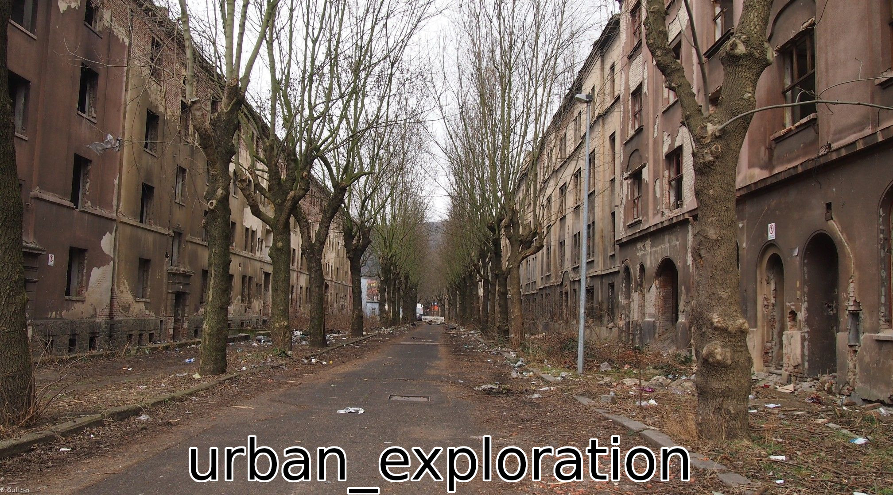

# abandoned place

## Challenge

the flag is outside of the pic, try to find it. another hint: dimensions, dimensions, everything is in dimensions.  
[abondoned_street_challenge2.jpg](https://ctflearn.com/challenge/download/1000)

---

## Analisis

Diberikan file gambar `abondoned_street_challenge2.jpg`, membukanya tidak mendapati hal mencurigakan secara visual  
  
  
  
Dari petunjuk pada deskripsi _challenge_ yaitu `_dimensions_`, asumsi saya langsung berkata bahwa dimensi gambar telah diubah secara sengaja untuk menyembunyikan sesuatu.  
Mencoba menggunakan script python [modsize.py](https://github.com/flawwan/modsize/blob/master/modsize.py) yang saya temukan di github

```python
import argparse
import os
from subprocess import call

import filetype
from loguru import logger

 #from pwnlib import log

rot_value = 0 #Default value
parser = argparse.ArgumentParser()
parser.add_argument("file", help="Filepath to image")
parser.add_argument("output", help="Filepath to image")
parser.add_argument("--width", "-sw", type=int, help="New width of image")
parser.add_argument("--height", "-sh", type=int, help="New height of image")
args = parser.parse_args()


def modify_file(offset1, offset2, filename,output, width=None, height=None):
	logger.info('Loading image')
	bin_arr = [] 
	with open(filename,'rb') as f:
		arr = f.read()
	for b in arr:
		bin_arr.append(b)
		
	org_width = hex(int(hex(bin_arr[offset1])[2:] + hex(bin_arr[offset1+1])[2:],16))
	org_height = hex(int(hex(bin_arr[offset2])[2:] + hex(bin_arr[offset2+1])[2:],16))

	#print(org_width)	

	logger.info("Image loaded!")
	logger.info("Detected width: %d px" % int(org_width,16))
	logger.info("Detected height: %d px" % int(org_height,16))

	if width == None and height == None:
		logger.warning("Nothing todo. Set width/height?")
		exit()

	if width == None:
		width = int(org_width, 16) 
	if height == None:
		height = int(org_height,16)
	

	new_width=str(hex(width))[2:].zfill(4) #Width bad adaptive filter value :(/
	new_height=str(hex(height))[2:].zfill(4)

	if str(org_width)[2:] != new_width:
		logger.info("New width: %d px" % int(new_width,16))
	if str(org_height)[2:] != new_height:
		logger.info("New height: %d px" % int(new_height,16))
	

	#Set width
	bin_arr[offset1]=int(str(new_width)[:2], 16)
	bin_arr[offset1+1]=int(str(new_width)[2:], 16)
	#set height
	bin_arr[offset2]=int(str(new_height)[:2], 16)
	bin_arr[offset2+1]=int(str(new_height)[2:], 16)

 
	logger.info("Saving new image file")
	with open(output, "wb") as binary_file:
		binary_file.write(b"".join([(x).to_bytes(1, 'big') for x in bin_arr]))
	logger.info("Image saved!")
	
def modify_png(filename,output,width,height):
	modify_file(18,22, filename,output,width,height)
	#Fix crc32 checksum
 
	logger.info("Fixing checksum of new image")

	FNULL = open(os.devnull, 'w')
	retcode = call(["pngcsum", "%s" % output, output + "new"])

	logger.info("Checksum now OK")

	os.remove("%s" % output)
	os.rename("%snew" % output, output)


def modify_jpg(filename,output,width,height):
	bin_arr = [] 
	with open(filename,'rb') as f:
		arr = f.read()
	prev = ""
	i = 0
	for b in arr:
		if prev + hex(b)[2:] == "ffc0":
			break
		i+=1
		prev = hex(b)[2:]
	logger.info("Found magic bytes on offset %d " % i)
	modify_file(i+6,i+4,filename,output,width,height)

def process_file(filename,output,width,height):
	kind = filetype.guess(filename)
	if kind is None:
		print('Filetype not supported!')
		return
	if kind.mime == "image/png":
		logger.info("Detected: png")
		modify_png(filename,output,width,height)
	elif kind.mime == "image/jpeg":
		logger.info("Detected: jpg")
		modify_jpg(filename,output,width,height)
	else:
		logger.info("Filetype not supported")
process_file(args.file, args.output, args.width, args.height)
```

Dengan command:

```bash
python3 modsize.py --width 2016 --height 2016 'abondoned_street_challenge2.jpg' outpng.png
```

Mencoba membuka `outpng.png`, memberikan kita flag  
  
  
  

---

## Flag

```urban_exploration```
