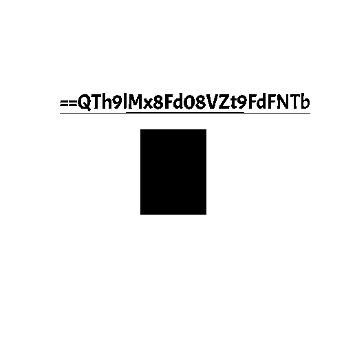

# Ambush Mission

## Deskripsi Challenge

Hi, i can't tell you my name since now i'm in a mission. In case to arrest our fugitive target, our team had been intercepted communication between the target with his fellow and found this image [clue.png](https://mega.nz/#!TKZ3DabY!BEUHD7VJvq_b-M22eD4VfHv_PPBnW2m7CZUfMbveZYw).  
It looks like they are going to meet in specific place, but we still don't know the time yet. Can you help me?

---

## Analisis Awal

File `clue.png` dibuka secara visual untuk pemeriksaan awal. Tidak ditemukan indikasi mencurigakan seperti teks tersembunyi atau artefak visual yang tidak wajar.  
  
  
  
Karena tidak ada petunjuk secara kasat mata, besar kemungkinan informasi disembunyikan menggunakan teknik **steganografi**, khususnya pada level bit.

---

## Analisis Steganografi

Untuk menganalisis kemungkinan data tersembunyi, digunakan tool **StegSolve** dengan fokus pada pemeriksaan **bit plane**.

Hasil analisis menunjukkan adanya sebuah string mencurigakan pada **Red Plane 0**:

```
==QTh9lMx8Fd08VZt9FdFNTb
```
  
  
  
  
---

## Proses Dekode

String tersebut memiliki ciri khas **Base64**, namun dengan urutan karakter yang terbalik. Hal ini dapat dikenali dari karakter padding `==` yang seharusnya berada di bagian akhir string, bukan di awal.

### Langkah decoding:

1. Membalik urutan string (reverse).
2. Mendekode hasilnya menggunakan Base64.

Proses dilakukan dengan satu baris perintah berikut:

```bash
echo '==QTh9lMx8Fd08VZt9FdFNTb' | rev | base64 -d
```

Output:

```
m3Et_me_4t_12_aM
```

---

## Flag

```text
m3Et_me_4t_12_aM
```
