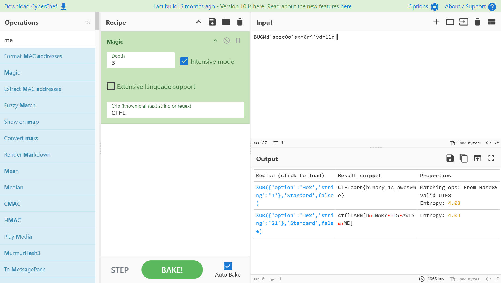

# Help Bity

Bity had the flag for his problem. Unfortunately, his negative friend Noty corrupted it. Help Bity retrieve his flag.  
He only remembers the first 4 characters of the flag: CTFL. Flag: ```BUGMd\`sozc0o\`sx^0r^\`vdr1ld|```

---

## Analisis

Diberikan string yang bitnya sudah dimodifikasi, mencoba menggunakan cyberchef dengan _recipe Magic_ dengan _intensive mode_ aktif dan _known plaintext_ yaitu `CTFL` mendapatkan output berikut:  
  
  
  
Dari output diatas diketahui bahwa ciphertext merupakan hasil encryption dengan operasi **XOR** dengan _key_ 1.  

---

## Flag

```CTFLearn{b1nary_1s_awes0me}```
