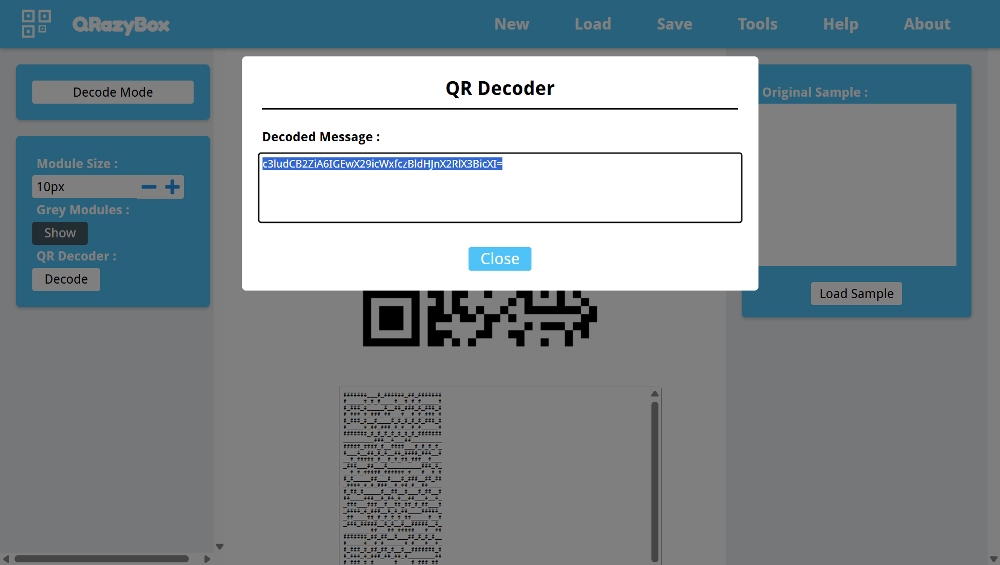
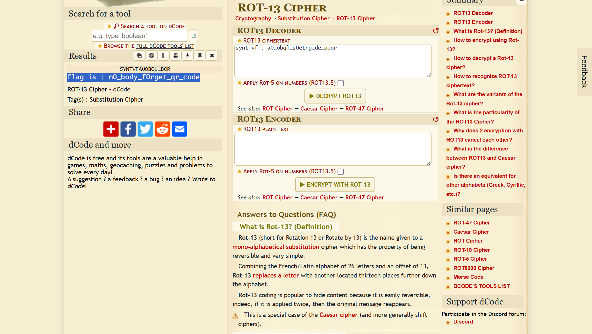

# QR Code

---

## Deskripsi

Do you remember something known as QR Code? Simple. Here for you : [link](https://mega.nz/#!eGYlFa5Z!8mbiqg3kosk93qJCP-DBxIilHH2rf7iIVY-kpwyrx-0)

---

## Analisis

Diberikan berupa gambar **_QR Code_** . Langkah awal yang dilakukan adalah melakukan proses decoding **_QR Code_** untuk mengekstrak data mentah yang tersimpan di dalamnya.  

  
Proses decoding **_QR Code_** dilakukan menggunakan [QRazyBox](https://merri.cx/qrazybox/), yang menghasilkan sebuah string terenkripsi dalam format Base64:  

  
```
c3ludCB2ZiA6IGEwX29icWxfczBldHJnX2RlX3BicXI=
```

---

## Dekode Base64

String Base64 tersebut kemudian didekode menggunakan utilitas CLI untuk memperoleh _plaintext_ awal:

```
echo "c3ludCB2ZiA6IGEwX29icWxfczBldHJnX2RlX3BicXI=" | base64 -d
```

Output:

```
synt vf : a0_obql_s0etrg_de_pbqr
```

Output tersebut masih belum bermakna secara langsung dan terlihat seperti hasil dari _substitution cipher_.

---

## Analisis Cipher

Pola karakter pada hasil sebelumnya mengindikasikan penggunaan **ROT13 cipher**, yaitu metode substitusi sederhana yang menggeser huruf sebanyak 13 posisi.
Dekode **ROT13** dilakukan menggunakan [dCode.fr](https://www.dcode.fr/rot-13-cipher), menghasilkan plaintext berikut:  

  
```flag is : n0_body_f0rget_qr_code```

---

## Flag

```n0_body_f0rget_qr_code```
