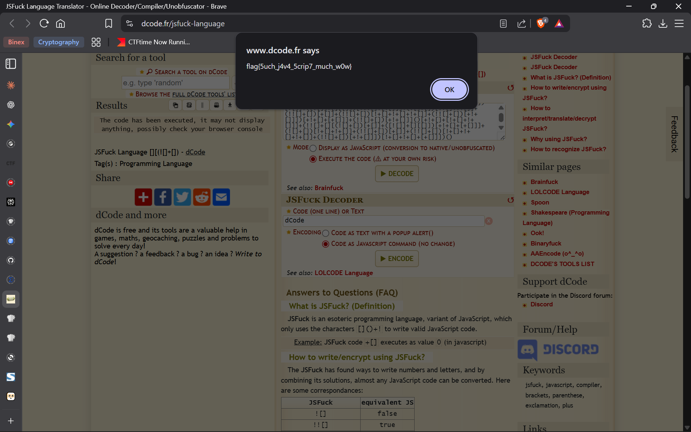

# What Could This Be?

## Challenge

It seems like someone really likes special characters… Or could it mean something more?  
[what_can_this_be.txt](https://mega.nz/#!SDQkUYQZ!b1Fu7iZ_wGiNX0aOjez95_74TYDCnLb3YSQfRzs0J-o)

---

## Analysis

Diberikan sebuah file teks bernama `what_can_this_be.txt`. Saat dibuka, file tersebut berisi rangkaian karakter yang tidak lazim, hanya terdiri dari:

```
[ ] ( ) + !
```

Pola karakter ini sangat khas dan mengarah pada **JSFuck**, sebuah teknik obfuscation JavaScript yang hanya menggunakan enam karakter tersebut untuk membentuk kode JavaScript yang valid.

Berdasarkan indikasi tersebut, string diasumsikan sebagai hasil **JSFuck encoding**. Untuk memverifikasi dan mendekodekannya, digunakan **JSFuck Decoder** dari situs dCode:

[dcode.fr](https://www.dcode.fr/jsfuck-language)

Setelah string dimasukkan dan dijalankan pada mode *Execute the code*, muncul sebuah popup JavaScript yang menampilkan flag.  
  
  
  

---

## Result

Hasil decoding JSFuck menghasilkan flag berikut:

```
flag{5uch_j4v4_5crip7_much_w0w}
```

---

## Flag

```text
flag{5uch_j4v4_5crip7_much_w0w}
```
