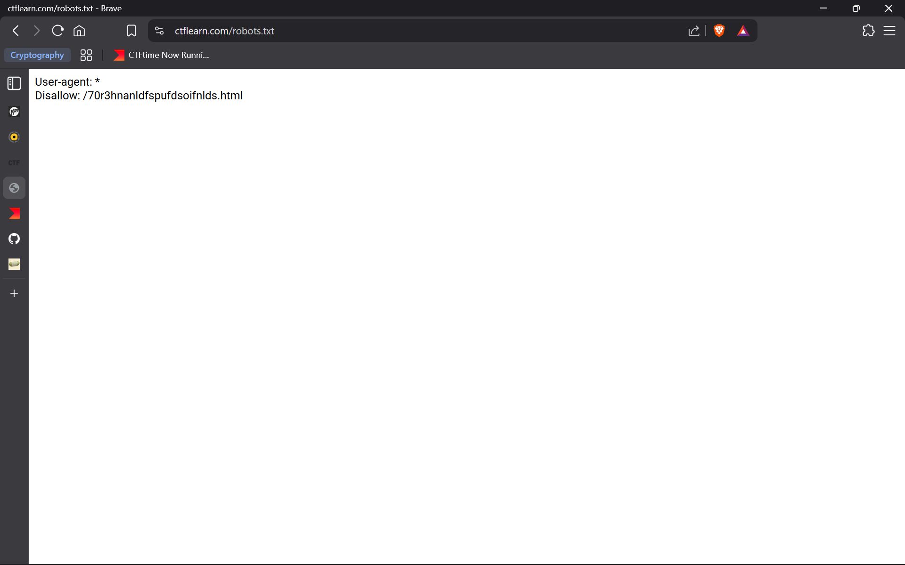
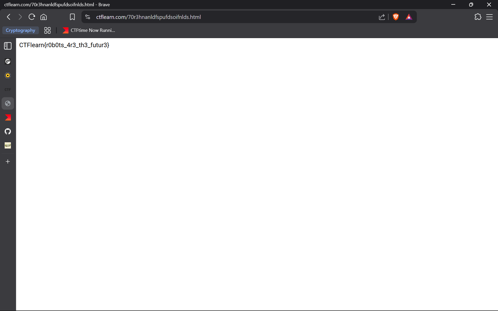

# Where Can My Robot Go?

## Deskripsi

Where do robots find what pages are on a website?

---

## Analisis

Kata kunci "**robots**" pada deskripsi mengarah pada keberadaan berkas `robots.txt`, yaitu sebuah file teks standar yang digunakan untuk memberikan instruksi kepada _web crawler_ (misalnya Googlebot) mengenai direktori atau halaman yang boleh maupun tidak boleh diakses (_crawled_).
Berdasarkan asumsi tersebut, dilakukan akses ke berkas berikut:

```
https://ctflearn.com/robots.txt
```



Dari isi berkas `robots.txt` diperoleh konfigurasi sebagai berikut:

```
User-agent: *
Disallow: /70r3hnanldfspufdsoifnlds.html
```

Konfigurasi ini menunjukkan bahwa semua _user-agent_ dilarang mengakses path `/70r3hnanldfspufdsoifnlds.html`.

## Eksploitasi

Selanjutnya, path yang tercantum pada aturan `Disallow` diakses secara langsung melalui browser:

```
https://ctflearn.com/70r3hnanldfspufdsoifnlds.html
```



Dari halaman tersebut, flag berhasil ditemukan.

---

## Flag

```CTFlearn{r0b0ts_4r3_th3_futur3}```
