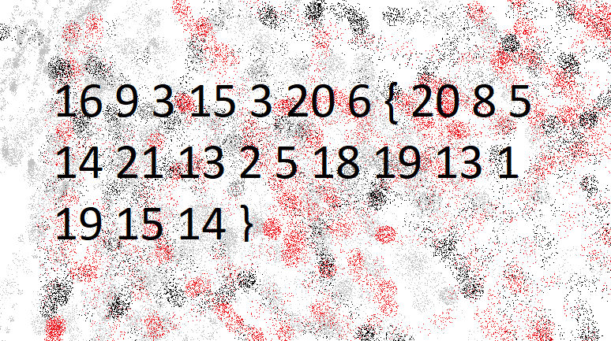

# picoCTF 2019 – Cryptography: The Numbers

## Description

The numbers... what do they mean?
[numbers.png](https://challenge-files.picoctf.net/c_fickle_tempest/7b39deba4212c233b1628c93f16639ed02ad90f51436d2a8914bb11f74a982d3/the_numbers.png)

<details>
  <summary><h2>Hint</h2></summary>
  The flag is in the format PICOCTF{}
</details>

---

## Objective

The objective of this challenge is to decode a sequence of numbers into readable text and recover the flag.

---

## Analysis



The image contains the following sequence:

```
16 9 3 15 3 20 6 { 20 8 5 14 21 13 2 5 18 19 13 1 19 15 14 }
```

This strongly suggests the use of the **A1Z26 cipher**, where:

* A = 1
* B = 2
* C = 3
* ...
* Z = 26

Each number corresponds to a letter of the alphabet.

---

## Approach

We decode each number into its corresponding letter:

* 16 → p
* 9 → i
* 3 → c
* 15 → o
* 3 → c
* 20 → t
* 6 → f

So the prefix becomes:

```
picoctf
```

---

## Automation (Optional)

You can automate the decoding using a Python script:

```python
def decode_a1z26(cipher_text):
    result = []

    for token in cipher_text.split():
        if token.isdigit():
            num = int(token)
            if 1 <= num <= 26:
                result.append(chr(num + 96))
        else:
            result.append(token)

    return ''.join(result)


cipher = "16 9 3 15 3 20 6 { 20 8 5 14 21 13 2 5 18 19 13 1 19 15 14 }"
print(decode_a1z26(cipher))
```
